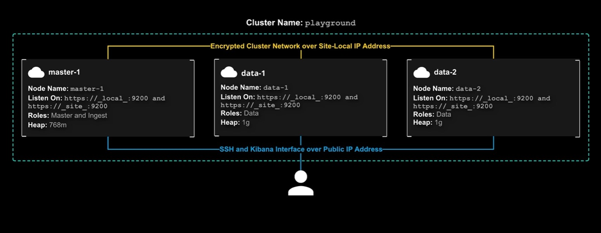

* Ingest Node - light version of logstash
* Logstash - processing and parsing

### Elasticsearch

Search and Analytics Engine

* Replicate shards - better search throughput


### Setup



```
# master node , data node 
sudo su
rpm --import https://artifacts.elastic.co/GPG-KEY-elasticsearch
curl -O https://artifacts.elastic.co/downloads/elasticsearch/elasticsearch-7.6.0-x86_64.rpm
rpm --install elasticsearch-7.6.0-x86_64.rpm
systemctl daemon-reload
systemctl enable elasticsearch.service
```

```
# master node , data node 

vim /etc/elasticsearch/elasticsearch.yml

```

### change heap size

```
vim /etc/elasticsearch/jvm.options

-Xms768m
-Xmx768m
```

### start elasticsaerch