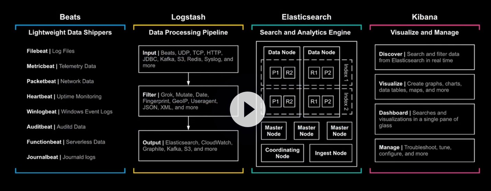

* Ingest Node - light version of logstash
* Logstash - processing and parsing

### Elasticsearch

Search and Analytics Engine

* Replicate shards - better search throughput


### Setup


```
# master node , data node 
sudo su
rpm --import https://artifacts.elastic.co/GPG-KEY-elasticsearch
curl -O https://artifacts.elastic.co/downloads/elasticsearch/elasticsearch-7.6.0-x86_64.rpm
rpm --install elasticsearch-7.6.0-x86_64.rpm
systemctl enable elasticsearch
```

```
# master node , data node 

vim /etc/elasticsearch/elasticsearch.yml

```

### change heap size

```
vim /etc/elasticsearch/jvm.options

-Xms768m
-Xmx768m
```

### start elasticsaerch

```
systemctl start elasticsearch
systemctl status elasticsearch

less /var/log/elasticsearch/playground.log
```

```
curl localhost:9200
curl localhost:9200/_cat/nodes

```

## Kibana

setup on master node
```
curl -O https://artifacts.elastic.co/downloads/kibana/kibana-7.6.0-x86_64.rpm
rpm --install kibana-7.6.0-x86_64.rpm
```

```
vim /etc/kibana/kibana.yml
```

```
systemctl start kibana
```

```
less /var/log/messages

<master node public ip>:8080
```

```
GET _cat/nodes?v
PUT 
DELETE 
```

### bulk index data 

```
GET _cat/nodes?v
GET _cat/indices?v
GET <index>/_search

PUT bank 
{
  "settings": {
    "number_of_shards": 1,
    "number_of_replicas": 1
  }
}

PUT shakespeare
{
  "mappings": {
    "properties": {
      "speaker":{
        "type":"keyword"
      },
      "play_name":{
        "type":"keyword"
      },
      "line_id":{
        "type":"integer"
      },
      "speech_number":{
        "type":"integer"
      }
    }
  },
  "settings": {
    "number_of_shards": 1,
    "number_of_replicas": 1
  }
}

PUT logs
{
  "mappings": {
    "properties": {
      "geo":{
        "properties": {
          "coordinates":{
            "type":"geo_point"
          }
        }
      }
    }
  },
  "settings": {
    "number_of_shards": 1,
    "number_of_replicas": 1
  }
}
```

```
cd /etc/elasticsearch
curl -O https://raw.githubusercontent.com/linuxacademy/content-elasticsearch-deep-dive/master/sample_data/accounts.json
curl -O https://raw.githubusercontent.com/linuxacademy/content-elasticsearch-deep-dive/master/sample_data/logs.json
curl -O https://raw.githubusercontent.com/linuxacademy/content-elasticsearch-deep-dive/master/sample_data/shakespeare.json
```

* no account / no cert bulk upload
```
curl -H "Content-Type:application/x-ndjson" -XPOST "localhost:9200/bank/_bulk"  --data-binary "@accounts.json"
curl -H "Content-Type:application/x-ndjson" -XPOST "localhost:9200/shakespeare/_bulk"  --data-binary "@shakespeare.json"
curl -H "Content-Type:application/x-ndjson" -XPOST "localhost:9200/logs/_bulk"  --data-binary "@logs.json"
```

* refresh data 
```
POST /bank/_refresh
POST /shakespeare/_refresh
POST /logs/_refresh
```

* see data 
```
GET <index>/_doc/<int>

GET bank/_doc/1
```

* CRUD 
```
GET bank/_doc/1000
PUT bank/_doc/1000
{
    "account_number" : 1000,
    "balance" : 1000000,
    "firstname" : "Myles",
    "lastname" : "Young",
    "age" : 32,
    "gender" : "M",
    "address" : "123 Holmes Lane",
    "employer" : "Pyrami",
    "email" : "amberduke@pyrami.com",
    "city" : "Brogan",
    "state" : "IL"
}

POST bank/_update/1000
{
  "doc": {
    "city" : "Chicago"
  }
}

DELETE bank/_doc/1000

```

## Non analyzed search
```
GET bank/_search?size=1
GET bank/_search
{
  "query": {
    "term": {
      "state.keyword": {
        "value": "CO"
      }
    }
  }
}
```

```

GET bank/_search
{
  "query": {
    "terms": {
      "state.keyword":[
          "CO",
          "PA"
        ]
    }
  }
}
```

```
GET bank/_search
{
  "size": 3, 
  "query": {
    "terms": {
      "state.keyword":[
          "CO",
          "PA"
        ]
    }
  }
}
```


```
GET shakespeare/_search
{
  "query": {
    "term": {
      "text_entry.keyword": {
        "value": "The king, the king!"
      }
    }
  }
}
```
## analyzed search

```
GET shakespeare/_search
{
  "query": {
    "match": {
      "text_entry": "King"
    }
  }
}
```

```
GET shakespeare/_search
{
  "query": {
    "match_phrase": {
      "text_entry": "My lord"
    }
  }
}
```

```
GET _analyze
{
  "analyzer": "standard",
  "text":"The QUICK brown Foxeds jumped over the fence."
}
```

```
GET _analyze
{
  "analyzer": "english",
  "text": "The QUICK brown Foxed jumped over the fence"
}
```

### metric aggregations

```
GET bank/_search
{
  "size": 0, 
  "aggs": {
    "avg_age": {
      "avg": {
        "field": "age"
      }
    }
  }
}
```

```
GET bank/_search
{
  "size": 0, 
  "aggs": {
    "age": {
      "max": {
        "field": "age"
      }
    }
  }
}

```

```
GET bank/_search
{
  "size": 0, 
  "aggs": {
    "total_balance": {
      "sum": {
        "field": "balance"
      }
    }
  }
}
```

### bucket aggregations

```
GET bank/_search
{
  "size":0,
  "aggs": {
    "accounts_per_state": {
      "terms": {
        "field": "state.keyword",
        "size": 10
      }
    }
  }
}
```

```
GET logs/_search
{
  "size": 0,
  "aggs": {
    "events_per_day": {
      "date_histogram": {
        "field": "@timestamp",
        "calendar_interval": "day"
      }
    }
  }
}
```
```
GET logs/_search
{
  "size": 0,
  "aggs": {
    "events_per_day": {
      "date_histogram": {
        "field": "@timestamp",
        "calendar_interval": "hour"
      }
    }
  }
}
```

### Sub aggregations

```
GET bank/_search
{
  "size": 0, 
  "aggs": {
    "state": {
      "terms": {
        "field": "state.keyword",
        "size": 50
      },
      "aggs": {
        "cities": {
          "cardinality": {
            "field": "city.keyword"
          }
        }
      }
    } 
  }
}
```

```
GET logs/_search
{
  "size": 0,
  "aggs": {
    "extension": {
      "terms": {
        "field": "extension.keyword",
        "size": 10
      },
      "aggs": {
        "bytes": {
          "sum": {
            "field": "bytes"
          }
        }
      }
    }
  }
}
```

```

GET logs/_search
{
  "size": 0,
  "aggs": {
    "extension": {
      "terms": {
        "field": "extension.keyword",
        "size": 10
      },
      "aggs": {
        "bytes": {
          "avg": {
            "field": "bytes"
          }
        }
      }
    }
  }
}

```

### pipeline aggregation

* parents
```

GET logs/_search
{
  "size": 0,
  "aggs": {
    "hour": {
      "date_histogram": {
        "field": "@timestamp",
        "calendar_interval": "hour"
      },
      "aggs": {
        "clients": {
          "cardinality": {
            "field": "clientip.keyword"
          }
        },
        "sum_of_clients":{
          "cumulative_sum": {
            "buckets_path": "clients"
          }
        }
      }
    }
  }
}

```

* siblings

```
GET logs/_search
{
  "size": 0,
  "aggs": {
    "hour": {
      "date_histogram": {
        "field": "@timestamp",
        "calendar_interval": "hour"
      },
      "aggs": {
        "clients": {
          "cardinality": {
            "field": "clientip.keyword"
          }
        },
        "sum_of_clients":{
          "cumulative_sum": {
            "buckets_path": "clients"
          }
        },
        "clients_per_minute":{
          "derivative": {
            "buckets_path": "sum_of_clients",
            "unit":"1m"
          }
        }
      }
    },
    "max_clients":{
      "max_bucket": {
        "buckets_path": "hour>clients"
      }
    },
    "min_clients":{
      "min_bucket": {
        "buckets_path": "hour>clients"
      }
    }
  }
}

```

# Collecting and Shipping Logs with Filebeat

* master & data node
```
curl -O https://artifacts.elastic.co/downloads/beats/filebeat/filebeat-7.6.0-x86_64.rpm
rpm --install filebeat-7.6.0-x86_64.rpm
systemctl enable filebeat
vim /etc/filebeat/filebeat.yml
filebeat modules enable system
filebeat setup
systemctl start filebeat
curl localhost:9200/_cat/indices?v -u elastic
```

# Collecting and Shipping System Telemetry with Metricbeat

* master
```
curl -O https://artifacts.elastic.co/downloads/beats/metricbeat/metricbeat-7.6.0-x86_64.rpm
rpm --install metricbeat-7.6.0-x86_64.rpm
vim /etc/metricbeat/metricbeat.yml
metricbeat modules list
metricbeat setup
systemctl start metricbeat
```